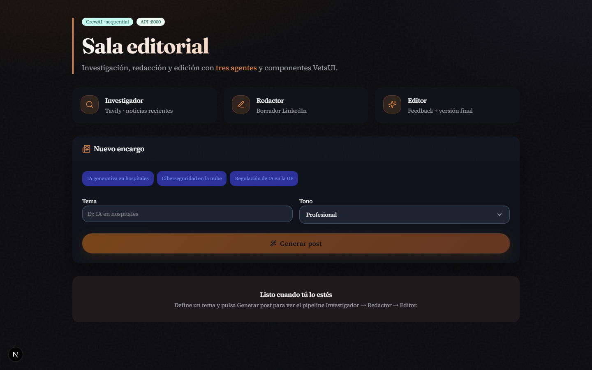
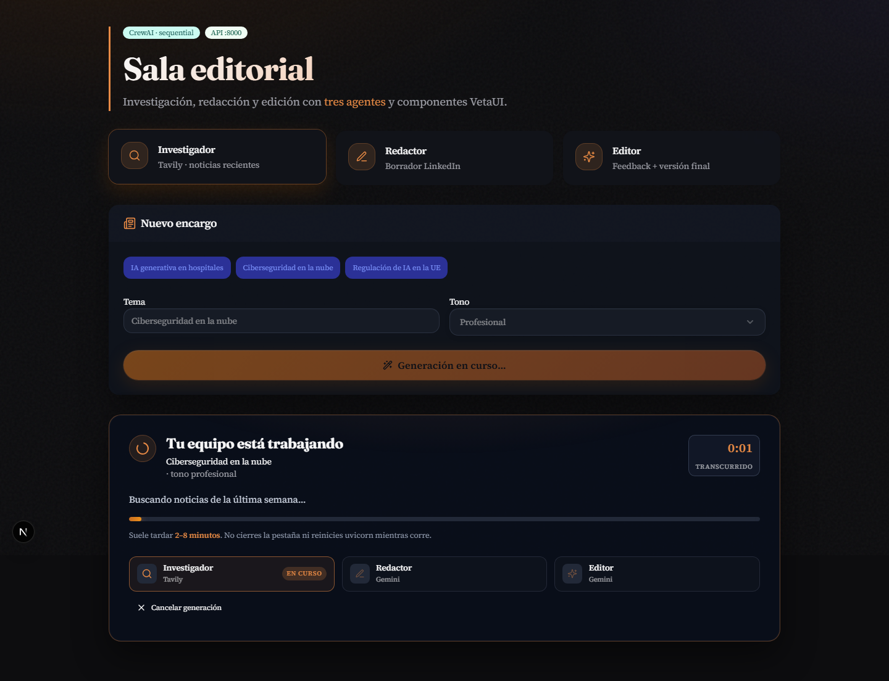
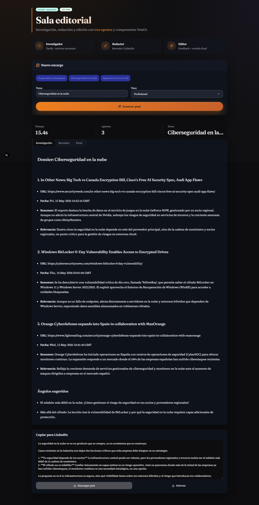
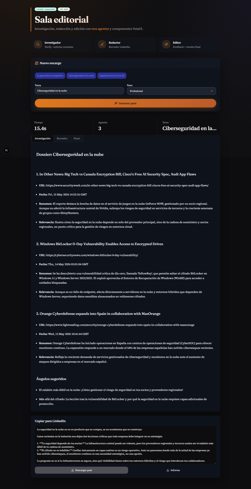
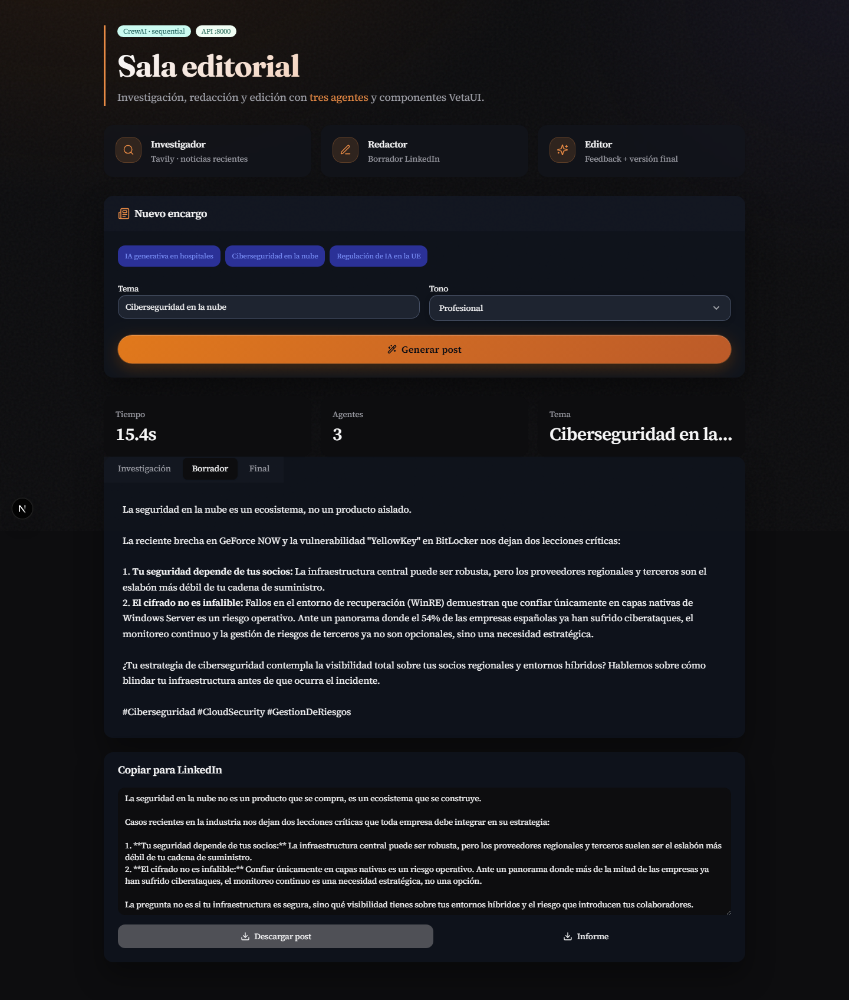
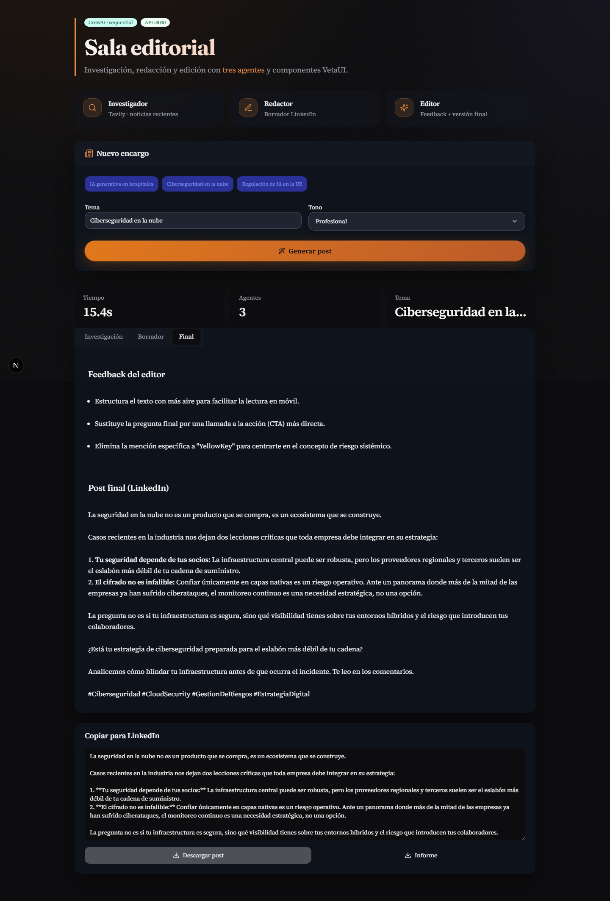
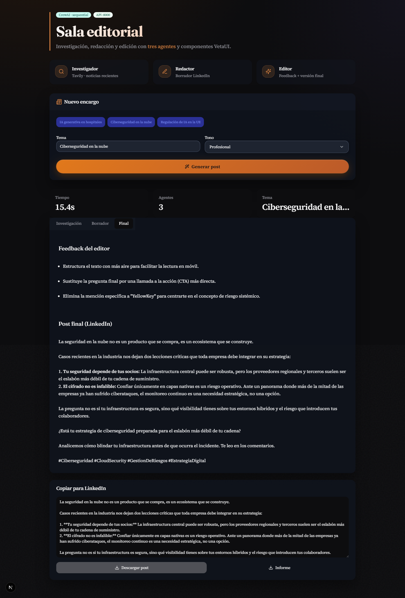
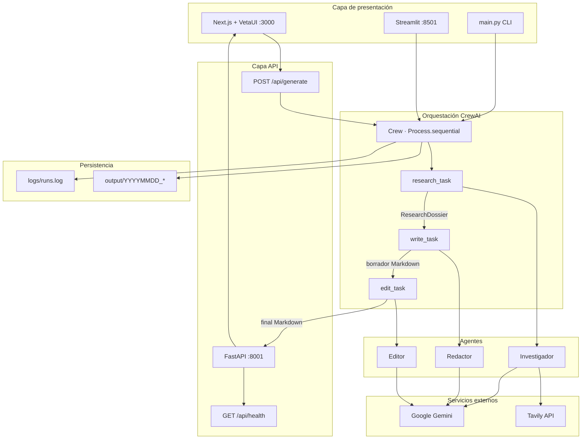
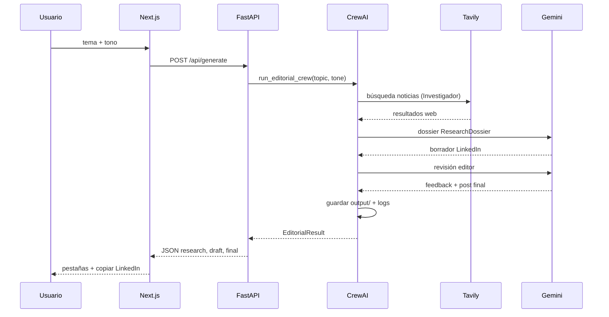
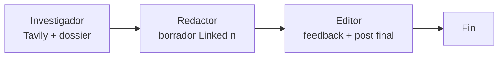

# Sala editorial CrewAI

Demo de **orquestación multiagente** con [CrewAI](https://docs.crewai.com): tres agentes especializados investigan un tema en la web, redactan un post de LinkedIn y un editor entrega la versión final lista para publicar.

> Proyecto pensado para **comparar frameworks de agentes** (CrewAI vs LangGraph): mismo caso de uso editorial, distinta forma de orquestar el pipeline.

---

## Tabla de contenidos

- [Qué hace](#qué-hace)
- [Características](#características)
- [Capturas de pantalla](#capturas-de-pantalla)
- [Arquitectura del sistema](#arquitectura-del-sistema)
- [Flujo de una petición](#flujo-de-una-petición)
- [API REST](#api-rest)
- [Modelo de datos](#modelo-de-datos)
- [Stack tecnológico](#stack-tecnológico)
- [Beneficios de CrewAI](#beneficios-de-crewai)
- [CrewAI vs LangGraph](#crewai-vs-langgraph)
- [Requisitos](#requisitos)
- [Instalación](#instalación)
- [Configuración](#configuración)
- [Ejecución](#ejecución)
- [Interfaz web (VetaUI)](#interfaz-web-vetaui)
- [Estructura del proyecto](#estructura-del-proyecto)
- [Flujo de agentes](#flujo-de-agentes)
- [Optimizaciones y UX](#optimizaciones-y-ux)
- [Salidas y logs](#salidas-y-logs)
- [Limitaciones](#limitaciones)
- [Repo hermano: LangGraph](#repo-hermano-langgraph)
- [Solución de problemas](#solución-de-problemas)
- [Regenerar capturas](#regenerar-capturas)

---

## Qué hace

1. El usuario ingresa un **tema** (ej. *Ciberseguridad en la nube*) y un **tono** (profesional, cercano, etc.).
2. El **Investigador** busca **3 noticias reales** recientes con [Tavily](https://tavily.com) y devuelve un dossier estructurado (Pydantic).
3. El **Redactor** escribe un **borrador** de post para LinkedIn usando solo ese dossier.
4. El **Editor** revisa el borrador y publica la **versión final** en un formato Markdown fijo (feedback + post).

Cada paso queda visible en la UI (pestañas) y se guarda en disco bajo `output/`.

**Interfaz principal:** Next.js 15 + [VetaUI](https://github.com/vetaui) en el puerto **3000**.  
**API:** FastAPI en el puerto **8001** (por defecto).

---

## Características

| Área | Detalle |
|------|---------|
| **Multiagente** | 3 roles (Investigador, Redactor, Editor) orquestados con CrewAI |
| **Búsqueda real** | Tavily devuelve noticias de la última semana sobre el tema |
| **LLM** | Google Gemini 3.1 Flash-Lite en los tres agentes |
| **Salida estructurada** | Dossier de investigación validado con Pydantic |
| **UI editorial** | VetaUI + panel de progreso, pestañas y copia para LinkedIn |
| **Persistencia** | Cada run guarda Markdown + `meta.json` en `output/` |
| **Trazabilidad** | Logs en `logs/runs.log` y consola de uvicorn |
| **Múltiples entradas** | Web (Next.js), API REST, CLI y Streamlit legacy |

---

## Capturas de pantalla

Las imágenes siguientes se generaron con la app en marcha (`npm run dev` + API con claves en `.env`). Para repetirlas: [Regenerar capturas](#regenerar-capturas).

### Pantalla inicial

Formulario de tema/tono, chips de ejemplo y tarjetas de los tres agentes.



### Generación en curso

Panel de progreso con temporizador, barra estimada, pasos del pipeline y botón **Cancelar**.



### Resultado completo

Métricas de la ejecución, pestañas de contenido y bloque **Copiar para LinkedIn**.



### Pestaña Investigación

Dossier del investigador (noticias, ángulos sugeridos).



### Pestaña Borrador

Post en borrador del redactor.



### Pestaña Final

Feedback del editor + post final.



### Copiar para LinkedIn

Vista del bloque listo para pegar en LinkedIn.



---

## Arquitectura del sistema

El proyecto sigue una **arquitectura en capas**: presentación (Next.js), API (FastAPI), orquestación (CrewAI) y servicios externos (Gemini + Tavily). La crew vive en `src/` y es agnóstica de la UI: la misma lógica sirve para la web, Streamlit y la CLI.

### Diagrama general



### Capas y responsabilidades

| Capa | Carpeta / archivo | Responsabilidad |
|------|-------------------|-----------------|
| **Presentación** | `web/` | Formulario, progreso, pestañas, descarga |
| **API** | `api/main.py` | Validación HTTP, CORS, llamada a `run_editorial_crew()` |
| **Orquestación** | `src/crew.py` | Monta la `Crew`, ejecuta `kickoff`, guarda artefactos |
| **Agentes** | `src/agents.py` | Roles, goals, LLM Gemini, tool Tavily |
| **Tasks** | `src/tasks.py` | Descripciones, `context`, `output_pydantic` |
| **Esquemas** | `src/schemas.py` | `ResearchDossier`, `NewsItem` |
| **Persistencia** | `output/`, `logs/` | Markdown por fase + metadatos de run |

### Mapeo código → concepto CrewAI

```
src/agents.py     →  Agent (role, goal, backstory, tools, llm)
src/tasks.py      →  Task (description, expected_output, context)
src/crew.py       →  Crew (agents, tasks, process=sequential)
src/schemas.py    →  output_pydantic en research_task
api/main.py       →  Punto de entrada HTTP
web/lib/api.ts    →  Cliente del frontend
```

### Principios de diseño

1. **Separación UI / lógica:** la crew no conoce Next.js; solo recibe `topic` y `tone`.
2. **Pipeline lineal:** `Process.sequential` — sin ramas ni bucles (adecuado para CrewAI).
3. **Una tool, un agente:** solo el investigador llama a Tavily; evita costes y alucinaciones cruzadas.
4. **Contrato de salida:** el investigador devuelve Pydantic; el editor devuelve Markdown con cabeceras fijas.
5. **Idempotencia de artefactos:** cada ejecución crea su carpeta en `output/` con timestamp.

Documentación técnica ampliada: [docs/architecture.md](docs/architecture.md)

---

## Flujo de una petición

Secuencia típica cuando el usuario pulsa **Generar post** en la web:



**Pasos internos de la crew:**

| Paso | Task | Agente | Entrada | Salida |
|------|------|--------|---------|--------|
| 1 | `research_task` | Investigador | `{topic}` | `ResearchDossier` (3 noticias) |
| 2 | `write_task` | Redactor | dossier + `{topic}`, `{tone}` | Borrador Markdown |
| 3 | `edit_task` | Editor | borrador + `{topic}`, `{tone}` | Feedback + post final |

El **contexto entre tasks** lo resuelve CrewAI con `context=[research_task]` y `context=[write_task]` en `tasks.py`: el redactor y el editor reciben automáticamente las salidas anteriores.

---

## API REST

| Método | Ruta | Descripción |
|--------|------|-------------|
| `GET` | `/api/health` | Estado del servicio |
| `POST` | `/api/generate` | Ejecuta la crew y devuelve el informe |

### `POST /api/generate`

**Body (JSON):**

```json
{
  "topic": "Ciberseguridad en la nube",
  "tone": "profesional"
}
```

**Respuesta (200):**

```json
{
  "topic": "Ciberseguridad en la nube",
  "tone": "profesional",
  "research": "# Dossier: ...",
  "draft": "## Borrador...",
  "final": "## Feedback del editor\n...\n## Post final (LinkedIn)\n...",
  "raw": "...",
  "elapsed_seconds": 14.2,
  "run_dir": "output/20260518_151505_ciberseguridad_en_la_nube"
}
```

**Errores:** `400` (validación / `.env` incompleto), `500` (fallo de crew, Gemini o Tavily).

CORS habilitado para `http://localhost:3000` y `http://127.0.0.1:3000`.

---

## Modelo de datos

### `ResearchDossier` (investigador)

Definido en `src/schemas.py` y forzado con `output_pydantic=ResearchDossier`:

| Campo | Tipo | Descripción |
|-------|------|-------------|
| `topic` | `string` | Tema investigado |
| `news_items` | `NewsItem[3]` | Exactamente 3 noticias |
| `suggested_angles` | `string[2-3]` | Ángulos para LinkedIn |

Cada `NewsItem` incluye: `title`, `url`, `date`, `summary`, `relevance`.

### Salida del editor (Markdown)

Formato obligatorio en el prompt del editor:

```markdown
## Feedback del editor
- ...
- ...
- ...

## Post final (LinkedIn)
(texto listo para publicar)
```

Si el modelo omite cabeceras, `crew.py` aplica `_normalize_editor_output()` para mantener el contrato.

---

## Stack tecnológico

| Componente | Uso |
|------------|-----|
| **CrewAI** | Agentes, tasks, crew secuencial |
| **crewai-tools** | `TavilySearchTool` (búsqueda web) |
| **tavily-python** | Cliente Tavily (requerido en runtime) |
| **google-genai** | Cliente Gemini para `crewai[google-genai]` |
| **Next.js + VetaUI** | Frontend editorial (`web/`) |
| **FastAPI + Uvicorn** | API REST (`api/`) |
| **Google Gemini** | LLM de los 3 agentes (`GEMINI_API_KEY`) |
| **Pydantic** | `ResearchDossier` del investigador |
| **Streamlit** | UI alternativa legacy (`app.py`, puerto 8501) |

### MCP VetaUI (Cursor)

En `.cursor/mcp.json` (o raíz del workspace):

```json
{
  "mcpServers": {
    "veta": {
      "command": "npx",
      "args": ["-y", "@vetaui/mcp"]
    }
  }
}
```

Herramientas útiles: `veta_overview`, `veta_list_components`, `veta_get_component`, `veta_get_theme`.

---

## Beneficios de CrewAI

Este repositorio usa CrewAI porque encaja con un **flujo editorial por roles** sin necesidad de definir un grafo explícito. Ventajas concretas en este proyecto:

### 1. Modelo mental por roles

Cada agente tiene `role`, `goal` y `backstory` en `src/agents.py`. Eso hace legible el equipo:

- **Investigador** — solo busca y estructura noticias.
- **Redactor** — solo escribe el borrador con el dossier.
- **Editor** — solo revisa y entrega el post final.

No mezclas responsabilidades en un único prompt gigante.

### 2. Tasks declarativas y encadenadas

En `src/tasks.py` defines **qué** debe hacer cada paso y **qué** se espera (`expected_output`). El encadenamiento con `context=[...]` inyecta la salida anterior sin serializar estado a mano.

### 3. Orquestación secuencial sin boilerplate

`Process.sequential` en `src/crew.py` ejecuta investigación → redacción → edición en orden. No necesitas escribir un bucle ni un state machine para este caso. Diagrama: [Pipeline secuencial](#pipeline-secuencial-crewai) en *Flujo de agentes*.

### 4. Tools acotadas por agente

Solo el investigador tiene `TavilySearchTool`. CrewAI limita qué herramientas ve cada agente, lo que reduce llamadas innecesarias y coste de API.

### 5. Salida estructurada con Pydantic

`output_pydantic=ResearchDossier` en la task de investigación obliga al modelo a devolver JSON válido contra el esquema. El frontend y `output/01_research.md` reciben datos consistentes.

### 6. Misma crew, varias interfaces

`run_editorial_crew()` se usa desde:

- FastAPI (`api/main.py`)
- CLI (`main.py`)
- Streamlit (`app.py`)

Un solo núcleo de negocio, múltiples UIs.

### 7. Observabilidad y depuración

- `verbose=True` en agentes y crew.
- Logs en `logs/runs.log`.
- Carpeta `output/` por ejecución para auditar cada fase.

### 8. Velocidad de iteración

Cambiar el tono, acortar prompts o ajustar `max_iter` se hace en archivos Python pequeños, sin tocar el frontend. Ideal para experimentar con el pipeline editorial.

### Resumen

| Beneficio CrewAI | En este repo |
|------------------|--------------|
| Roles claros | `agents.py` — 3 agentes especializados |
| Pipeline lineal | `Process.sequential` |
| Contexto automático | `context` en `tasks.py` |
| Tools por agente | Tavily solo en investigador |
| Validación de datos | `ResearchDossier` (Pydantic) |
| Reutilización | API + CLI + Streamlit |
| Menos código de orquestación | No hay grafo ni router manual |

**CrewAI brilla aquí porque** el flujo es **lineal y por roles**: investigar → redactar → editar. Eso es exactamente el modelo de una sala editorial pequeña.

---

## CrewAI vs LangGraph

| Criterio | CrewAI (este repo) | [LangGraph](../editorial-graph-langgraph/) |
|----------|-------------------|-------------------------|
| **Modelo** | Agentes + tasks + crew | Nodos + estado + aristas |
| **Estado** | Implícito vía `context` | `TypedDict` explícito |
| **Flujo** | Secuencia fija | Condicional y bucles |
| **Revisión** | Una pasada del editor | Bucle editor ↔ redactor |
| **Complejidad** | Baja, pocos archivos | Mayor, más control |
| **Curva de aprendizaje** | Rápida para pipelines simples | Mejor para lógica compleja |
| **Cuándo elegir** | MVP, demos, pipelines lineales | Producción con ramas y retries |

Este proyecto es la **referencia CrewAI** del comparativo. El repo LangGraph hermano repetirá el caso de uso con estado explícito y un grafo exportable (`draw_mermaid_png`).

---

## Requisitos

- **Python** 3.10 – 3.13
- **Node.js** 18+ (frontend)
- Cuenta **Google AI** → [AI Studio](https://aistudio.google.com/apikey) (`GEMINI_API_KEY`)
- Cuenta **Tavily** → [registro gratuito](https://app.tavily.com/) (`TAVILY_API_KEY`)
- Conexión a internet

---

## Instalación

### Backend (Crew + API)

```powershell
cd editorial-crew-crewai
python -m venv .venv
.\.venv\Scripts\activate
pip install -r requirements.txt
pip install -r api\requirements.txt
copy .env.example .env
```

**Dependencias críticas** (ya van en `requirements.txt`; si falla la generación, reinstala):

```powershell
pip install "crewai[google-genai]" tavily-python google-genai
```

### Frontend (VetaUI)

```powershell
cd web
copy .env.local.example .env.local
npm install
```

### ¿Qué es `.venv`?

Carpeta con un Python **aislado** solo para este proyecto. No se sube a Git (`.gitignore`).

---

## Configuración

Edita `.env` en la raíz del repo:

```env
GEMINI_API_KEY=tu-clave-gemini
TAVILY_API_KEY=tvly-tu-clave-tavily
GEMINI_MODEL_NAME=gemini/gemini-3.1-flash-lite-preview
CREWAI_TRACING_ENABLED=false
```

| Variable | Obligatoria | Descripción |
|----------|-------------|-------------|
| `GEMINI_API_KEY` | Sí | Clave Google Gemini para los 3 agentes |
| `TAVILY_API_KEY` | Sí | Búsqueda web del investigador |
| `GEMINI_MODEL_NAME` | No | Modelo CrewAI (default: `gemini/gemini-3.1-flash-lite-preview`) |
| `CREWAI_TRACING_ENABLED` | No | Pon `false` para evitar prompts interactivos de trazas en consola |

### Frontend — `web/.env.local`

```env
NEXT_PUBLIC_API_URL=http://localhost:8001
# Opcional: timeout del fetch (ms). Default 1_500_000 (25 min)
# NEXT_PUBLIC_GENERATE_TIMEOUT_MS=1500000
```

El puerto de la API **debe coincidir** con el que uses al arrancar uvicorn (recomendado: **8001**).

### ¿Qué es Tavily?

Servicio de **búsqueda web para agentes**. El investigador lo usa para encontrar noticias reales del tema. Sin `TAVILY_API_KEY` la crew falla o se queda bloqueada esperando herramientas.

---

## Ejecución

### Opción recomendada — dos terminales

**Terminal 1 — API (sin `--reload`, puerto 8001):**

```powershell
cd editorial-crew-crewai
.\scripts\run-api.ps1
```

Si el puerto ya está en uso pero la API responde, el script te avisa y **no** arranca un segundo servidor.

**Terminal 2 — Frontend:**

```powershell
cd editorial-crew-crewai\web
npm run dev
```

Abre **http://localhost:3000**, elige un tema (o un chip de ejemplo) y pulsa **Generar post**.

### Arranque manual de la API

```powershell
.\.venv\Scripts\activate
uvicorn api.main:app --host 127.0.0.1 --port 8001
```

> **No uses `--reload` en desarrollo de la crew:** WatchFiles reinicia uvicorn a mitad de `POST /api/generate` y corta la petición.

### Script todo-en-uno

```powershell
.\scripts\run-dev.ps1
```

Arranca API en **8001** y luego `npm run dev` en `web/`.

### Comprobar que la API vive

```powershell
Invoke-WebRequest http://localhost:8001/api/health
# {"status":"ok","service":"editorial-crew-crewai"}
```

### Streamlit (alternativa)

```powershell
.\.venv\Scripts\activate
streamlit run app.py
```

→ http://localhost:8501

### CLI (sin UI)

```powershell
python main.py "Ciberseguridad en la nube" --tone profesional
```

### Tiempos esperados

| Escenario | Tiempo aproximado |
|-----------|-------------------|
| Primera ejecución (deps frías, Tavily + Gemini) | 1–3 min |
| Ejecución normal optimizada | **15 s – 90 s** |
| Tema muy amplio o red lenta | hasta ~3 min |

El frontend espera hasta **25 minutos** antes de abortar (`NEXT_PUBLIC_GENERATE_TIMEOUT_MS`).

---

## Interfaz web (VetaUI)

| Elemento | Comportamiento |
|----------|----------------|
| **Tema / Tono** | Inputs obligatorios; chips rellenan el tema |
| **Generar post** | `POST /api/generate` con cancelación (`AbortSignal`) |
| **Panel de generación** | Timer, barra de progreso estimada, 3 pasos (Investigador → Redactor → Editor), hints rotativos |
| **Cancelar** | Aborta el fetch; la API puede seguir unos segundos en segundo plano |
| **Pestañas** | Investigación · Borrador · Final |
| **Copiar para LinkedIn** | Extrae solo el post final del Markdown |
| **Layout** | Responsive vía grids CSS en `web/app/editorial.css` |

Componentes clave:

- `web/components/editorial-room.tsx` — sala principal
- `web/components/generation-progress.tsx` — UX de generación
- `web/lib/api.ts` — cliente HTTP y timeouts
- `web/lib/use-generation-timer.ts` — fases estimadas del pipeline

---

## Estructura del proyecto

```
editorial-crew-crewai/
├── web/                         # Next.js + VetaUI (UI principal)
│   ├── app/                     # layout, globals.css, editorial.css
│   ├── components/              # editorial-room, generation-progress
│   └── lib/                     # api.ts, types, timer
├── api/main.py                  # FastAPI → crew
├── app.py                       # Streamlit (legacy)
├── main.py                      # CLI
├── requirements.txt             # crewai, tavily, google-genai, streamlit
├── api/requirements.txt         # fastapi, uvicorn
├── .env.example
├── src/
│   ├── agents.py                # 3 agentes + Tavily + Gemini
│   ├── tasks.py                 # Tasks secuenciales
│   ├── schemas.py               # ResearchDossier
│   ├── crew.py                  # Crew + normalización editor + output/
│   └── logging_config.py
├── docs/
│   ├── architecture.md
│   └── screenshots/             # Capturas del README
├── output/                      # Cada ejecución (gitignored)
├── logs/runs.log
└── scripts/
    ├── run-api.ps1              # API estable en :8001
    ├── run-dev.ps1              # API + frontend
    ├── capture_screenshots.py   # Playwright → docs/screenshots/
    └── kill-port-8000.ps1       # Liberar puerto 8000 si quedó zombie
```

---

## Flujo de agentes

### Pipeline secuencial (CrewAI)

Tres agentes en fila, **una pasada cada uno**. El contexto de tareas anteriores se pasa con `context=[...]`; no hay bucle ni rama condicional en este repo:



Orquestación: `Process.sequential` en `src/crew.py`.

| # | Agente | Herramienta | Entrega |
|---|--------|-------------|---------|
| 1 | **Investigador** | Tavily (`basic`, máx. 3 resultados) | `ResearchDossier` (3 noticias + ángulos) |
| 2 | **Redactor** | — | Borrador LinkedIn (Markdown) |
| 3 | **Editor** | — | Feedback (bullets) + post final |

**Proceso:** `Process.sequential` — cada task recibe contexto de las anteriores (`context=[...]`).

**Modelo por defecto:** `gemini/gemini-3.1-flash-lite-preview` vía `crewai[google-genai]`.

**Iteraciones limitadas** (`max_iter` en agentes) para acotar latencia y coste.

---

## Optimizaciones y UX

| Mejora | Detalle |
|--------|---------|
| **Gemini Flash-Lite** | Modelo rápido para los 3 agentes |
| **Tavily acotado** | `search_depth=basic`, `max_results=3` |
| **Tasks más cortas** | Menos tokens por paso |
| **Sin guardrail pesado en editor** | Formato fijo en prompt + `_normalize_editor_output()` |
| **`CREWAI_TRACING_ENABLED=false`** | Sin prompt `[y/N]` en consola |
| **API sin reload** | `run-api.ps1` evita cortes mid-request |
| **Timeout frontend 25 min** | Evita abortos prematuros en runs lentos |
| **Panel de progreso** | Feedback visual durante la espera |
| **Salida Pydantic** | Investigación estructurada y estable |
| **Guardado en `output/`** | `01_research.md`, `02_draft.md`, `03_final.md`, `meta.json` |

---

## Salidas y logs

Tras cada generación exitosa:

```
output/20260518_151505_ciberseguridad_en_la_nube/
├── meta.json
├── 01_research.md
├── 02_draft.md
└── 03_final.md
```

Logs de aplicación: `logs/runs.log`  
La API también imprime inicio/fin de cada `POST /api/generate` en la consola de uvicorn.

---

## Limitaciones

- Una sola pasada del editor (sin bucle de revisión).
- Dependencia de APIs externas (cuota Tavily + Gemini).
- Sin autenticación, colas ni rate limiting de producción.
- La UI estima el progreso por tiempo, no por eventos reales de CrewAI.

---

## Repo hermano: LangGraph

Example app **independiente** con el mismo caso de uso (tema → post LinkedIn):

**[editorial-graph-langgraph](../editorial-graph-langgraph/)**

| CrewAI (este repo) | LangGraph (hermano) |
|--------------------|---------------------|
| `Process.sequential` | `StateGraph` + aristas condicionales |
| Una pasada del editor | Bucle editor ↔ redactor |
| Next.js + VetaUI | Streamlit + API |

No comparten código ni `.venv` — solo sirven para **comparar orquestadores** con apps sencillas y bien documentadas.

---

## Solución de problemas

| Problema | Causa habitual | Solución |
|----------|----------------|----------|
| `Faltan variables en .env` | `.env` vacío o sin copiar desde ejemplo | `copy .env.example .env` y rellena claves |
| `ModuleNotFoundError: crewai` | venv no activado | `.\.venv\Scripts\activate` + `pip install -r requirements.txt` |
| Error 500 / Gemini | Falta `google-genai` | `pip install google-genai "crewai[google-genai]"` |
| Se queda 20+ min en “Generando” | Falta `tavily-python` o prompt de tracing | `pip install tavily-python`; `CREWAI_TRACING_ENABLED=false` |
| `WinError 10048` puerto en uso | Varios uvicorn o proceso zombie | `.\scripts\run-api.ps1` (detecta API viva) o libera puerto; usa **8001** |
| Frontend no llega a la API | `NEXT_PUBLIC_API_URL` incorrecto | `web/.env.local` → `http://localhost:8001` y reinicia `npm run dev` |
| Timeout en el navegador | Run muy lento o API caída | Revisa consola uvicorn; sube timeout si hace falta |
| Petición cortada a mitad | `uvicorn --reload` | Arranca **sin** `--reload` (`run-api.ps1`) |
| UI sin estilos VetaUI | Tailwind no escanea paquetes | `@source` en `web/app/globals.css` |
| Error Tavily 401/403 | Clave inválida o sin cuota | Revisa [app.tavily.com](https://app.tavily.com/) |

### Liberar puerto 8000 (legacy)

```powershell
.\scripts\kill-port-8000.ps1
```

### Reiniciar todo limpio

1. Cierra terminales con uvicorn / `npm run dev`.
2. `.\scripts\run-api.ps1`
3. `cd web && npm run dev`
4. Comprueba `http://localhost:8001/api/health`

---

## Regenerar capturas

Con API y frontend en marcha y claves válidas en `.env`:

```powershell
.\.venv\Scripts\activate
pip install playwright
playwright install chromium
python scripts/capture_screenshots.py
```

Genera en `docs/screenshots/`:

| Archivo | Contenido |
|---------|-----------|
| `01_ui_inicio.png` | Pantalla inicial |
| `05_generando.png` | Panel “Generando…” |
| `02_ui_resultado.png` | Resultado con pestañas |
| `03_pestana_investigacion.png` | Tab Investigación |
| `04_pestana_borrador.png` | Tab Borrador |
| `06_pestana_final.png` | Tab Final |
| `07_copiar_linkedin.png` | Bloque copiar |

El script usa Playwright contra **http://localhost:3000** y lanza una generación real (~1 min).

---

## Licencia

MIT
