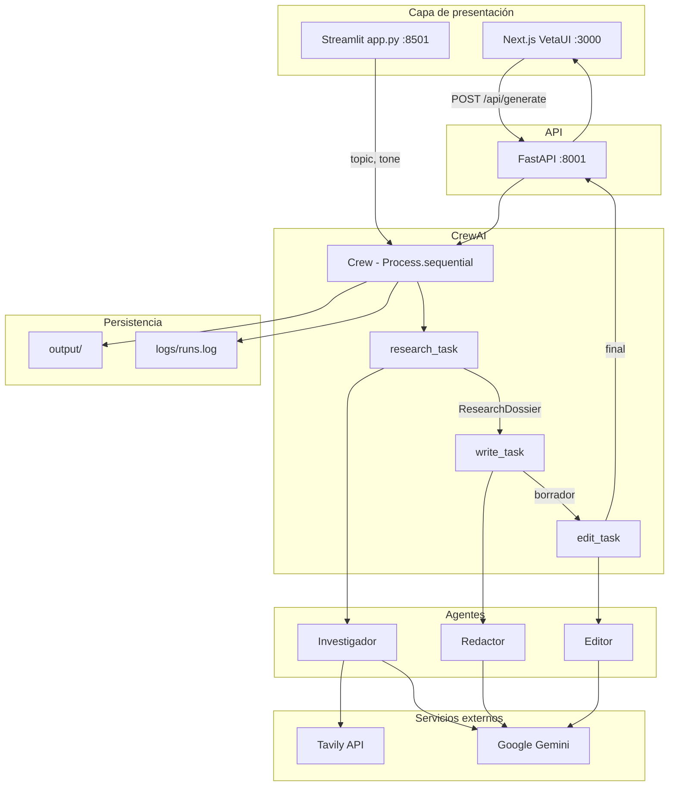

# Arquitectura — Sala editorial CrewAI

## Diagrama de flujo

## Capas

| Capa | Implementación |
|------|----------------|
| **UI principal** | `web/` — Next.js 15, VetaUI, panel de progreso |
| **API** | `api/main.py` — health + generate |
| **LLM** | Gemini vía `crewai[google-genai]` y `GEMINI_API_KEY` |
| **Tools** | `TavilySearchTool` solo en investigador |
| **Estado** | Contexto implícito entre tasks (`context=[...]`) |
| **Validación investigador** | `output_pydantic=ResearchDossier` |
| **Validación editor** | Prompt con formato fijo + `_normalize_editor_output()` en `crew.py` |
| **Orquestación** | `Crew` + `Process.sequential` |

## Task 1 — Investigación

- **Salida:** `ResearchDossier` (Pydantic)
- **Campos:** `topic`, `news_items[3]`, `suggested_angles`
- **Tool:** Tavily (`basic`, `max_results=3`)

## Task 2 — Redacción

- **Contexto:** `research_task`
- **Reglas:** solo datos del dossier; ~180 palabras

## Task 3 — Edición

- **Contexto:** `write_task` (borrador)
- **Salida:** Markdown con `## Feedback del editor` y `## Post final (LinkedIn)`

## Comparación con LangGraph (prevista)

| CrewAI | LangGraph |
|--------|-----------|
| Contexto de tasks | `State` explícito |
| Secuencia fija | Nodos + aristas condicionales |
| Una pasada del editor | Bucle editor ↔ redactor |
